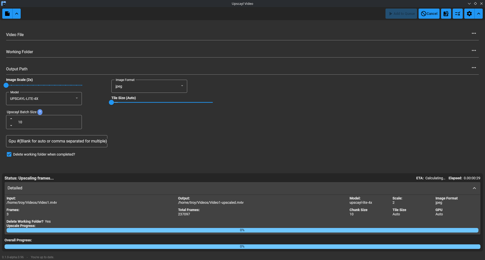

# UpscaylVideo

UpscaylVideo is a cross-platform batch video upscaling tool that orchestrates [Upscayl](https://github.com/upscayl/upscayl) and ffmpeg to extract frames from video, upscale them using AI, and reassemble the video. It features a modern Avalonia UI, job queue, progress/cancellation controls, and supports Windows, Linux, and macOS.



## Features

- Batch upscaling of videos using Upscayl and ffmpeg
- Job queue with progress, ETA, and cancellation
- Modern UI with real-time feedback
- Supports most common video formats
- Cross-platform: Windows, Linux & macOS

## Requirements

- [Upscayl](https://github.com/upscayl/upscayl) (CLI binary must be installed
  and path accessible)
- [ffmpeg](https://ffmpeg.org/)

## Installation

- Download UpscaylVideo from
  [Releases](https://github.com/troygeiger/UpscaylVideo/releases) Assets for your
  platform and extract (sorry, no installers or packages yet while focusing on features).

### Install Prerequisites

#### Windows (using Winget)

Install both ffmpeg and Upscayl with:

```shell
winget install Gyan.FFmpeg Upscayl.Upscayl
```

#### Linux

- Install ffmpeg using your package manager (e.g. `sudo apt install ffmpeg`)
- Download and extract the Upscayl binary from [Upscayl releases](https://github.com/upscayl/upscayl/releases)
- Make sure both `ffmpeg` and the Upscayl binary are in your PATH or specify their locations in the app settings

#### macOS

- Install ffmpeg using Homebrew: `brew install ffmpeg`
- Download the Upscayl binary from [Upscayl releases](https://github.com/upscayl/upscayl/releases)
- Ensure both `ffmpeg` and the Upscayl binary are in your PATH or specify their locations in the app settings

## Usage

1. Launch UpscaylVideo.
2. Add one or more video files to the queue.
3. Select your desired Upscayl model and settings.
4. Start the queue. Progress and ETA will be shown for each job.
5. Cancel jobs at any time using the Cancel button.

Output files will be saved to the location you specify when enqueuing jobs.

## Troubleshooting

- If Upscayl or ffmpeg are not detected, check your PATH or set their locations in the app configuration.
- For best results, use the latest versions of both tools.

## License

This project is not affiliated with the Upscayl project. See
[Upscayl](https://github.com/upscayl/upscayl) for their license and details.
